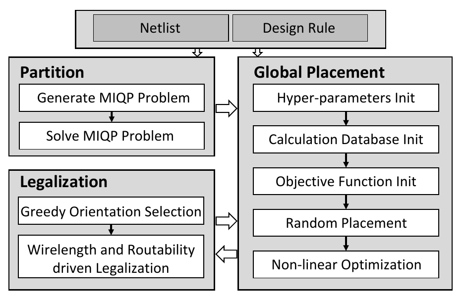

# ULTRA-2.5D

**An Analytical Placement Framework for Ultra-Large-Scale Multi-Reticle Chiplet Systems**

ULTRA-2.5D is an analytical placement framework for ultra-large-scale, multi-reticle 2.5D chiplet systems. Through partitioning, differentiable global placement, and legalization, it jointly optimizes chiplet positions, rotations, and flips while considering cross-reticle connectivity and stitching constraints.

## Method Overview

- **Multi-reticle partitioning**: Uses MIQP to assign chiplets to reticles or stitching regions, considering connectivity, critical nets, and area utilization; a heuristic partitioning implementation is also provided.
- **Differentiable global placement**: Uses Gumbel-softmax to relax discrete orientations and jointly optimize positions, rotations, and flips, with GPU acceleration support.
- **Constraint-aware legalization**: Combines discrete orientation selection, constraint graphs, and linear programming to eliminate overlaps and satisfy boundary constraints; includes routability evaluation and optimization modules.

<p align="center">
  
</p>

*Overall flow, reproduced from Fig. 6 of the paper.*

## Directory Structure

```text
ULTRA-2.5D/
├── main.py                       # Python flow entry point
├── src/cu_placer/                # C++/CUDA placement, legalization, and routability modules
├── python/
│   ├── partition/                # MIQP, genetic algorithm, and geometric heuristic partitioning
│   ├── placer/                   # Placement engine wrappers
│   └── utils/                    # Data I/O utilities
├── celldata/                     # Selected benchmarks, placement strategies, and existing partition results
├── scripts/
│   ├── reticle_type/             # Reticle geometry and adjacency matrix generation scripts
│   ├── regular_chiplet_gen/      # Regular chiplet benchmark generation tools
│   ├── routability_viewer/       # Routability visualization tools
│   └── dynamic_viewer.html       # Placement process viewer
└── docs/                         # Project documentation
    └── result/
        ├── result.md             # Experimental figures, tables, and data
        └── image/                # Documentation images
```

*Note: Since the source files for the 225-chiplet and 1225-chiplet cases are large, an additional chiplet generation tool has been implemented to generate these two cases.*

## Building and Running

The following build and run commands target **Linux**.

### 1. Prepare Dependencies and Build

- CMake ≥ 3.13, a compiler supporting C++17, and the CUDA Toolkit.
- IBM ILOG CPLEX (with a valid license), Boost, JsonCpp, spdlog, Armadillo, BLAS/LAPACK/OpenBLAS, OptimLib, and its BaseMatrixOps headers.
- Python 3 and the dependencies required by the Python flow:

```bash
python -m pip install numpy matplotlib pyomo deap
```

First, replace `/path/to/...` in `src/cu_placer/CMakeLists.txt` with the actual installation paths, and adjust `CMAKE_CUDA_ARCHITECTURES` for your GPU (currently set to `80`).

```bash
cmake -S src/cu_placer -B src/cu_placer/build
cmake --build src/cu_placer/build -j
```

The generated executable is located at `src/cu_placer/bin/cu_placer`. In each benchmark's `strategy.json`, `en_gpu` controls whether the GPU is used at runtime; the current build configuration still depends on CUDA even when CPU execution is selected.

### 2. Run Placement Using Existing Partition Results

The local `celldata/atplace_case/case_36c/` directory already contains placement inputs, `strategy.json`, and partition results. After building as described above, run the following from the project root:

```bash
./src/cu_placer/bin/cu_placer "$PWD/" "celldata/atplace_case/case_36c/"
```

The two arguments are the project root directory and the relative benchmark directory, respectively. **Both must retain the trailing `/`.** The input files are:

| File (relative to the benchmark directory) | Contents | Source / Generation Method |
| --- | --- | --- |
| `json_chiplets/chiplet.json` | Chiplet, pin, and net information | Generated from the benchmark description by `python/case_generator/generator.py` in the full project; `python/cluster_assignment/cluster_assignment.py` then updates pin-cluster assignments. |
| `json_chiplets/interposer.json` | Interposer information | Generated by `python/case_generator/generator.py` in the full project from the `interposer` field in the benchmark description. |
| `place_init/case_discription.json` | Benchmark description and connectivity matrices; the filename retains the spelling used in the code | Derived from `case_discription.json` in the benchmark root; `MainFlow.generate_case()` in the full project either copies it directly or calls `python/bstree_fastSA/fastSA.py` to perform initial placement and update it. |
| `hur_partition/reticle_msg.txt` | `[x, y, w, h]` for each reticle | Exported by `python/partition/huristic_partition.py` after reading the `Gr` array from the selected reticle `.npz`; the `.npz` can be generated by `scripts/reticle_type/gen_reticle.py`. |
| `hur_partition/chiplet_allocation.txt` | Chiplet partition assignments | Written by the external `milp_solver` in the MIQP flow; alternatively generated by `run_GA()` in `huristic_partition.py`, or by `python/partition/geo_partition.py` with this path specified through `--out`. |
| `strategy.json` | GPU switch, spacing, optimization stages, and parameter scheduling | A benchmark-level configuration file configured by the user; see `celldata/atplace_case/case_36c/strategy.json` for an example. The placer reads it in `src/cu_placer/flow.h`. |

The final placement is written to `placer/chiplet_pla.json` under the benchmark directory. Execution logs and snapshots are also stored under `placer/`. Repeated runs update this result file.

### 3. Run the Full Python Entry Point

To repartition before placement, complete the following configuration steps and then run `python main.py`:

1. Update `work_path` and `case_idx` in `main.py` to select existing benchmarks and matching reticle `.npz` files.
2. Update `path_exe` in `python/placer/placer.py` to point to the compiled `cu_placer`.
3. `option` can be `milp` or `gd`.

The reticle `.npz` contains the adjacency matrix `Cr` and geometry array `Gr`; see `scripts/reticle_type/gen_reticle.py` for generation.

