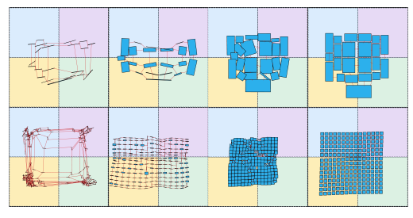
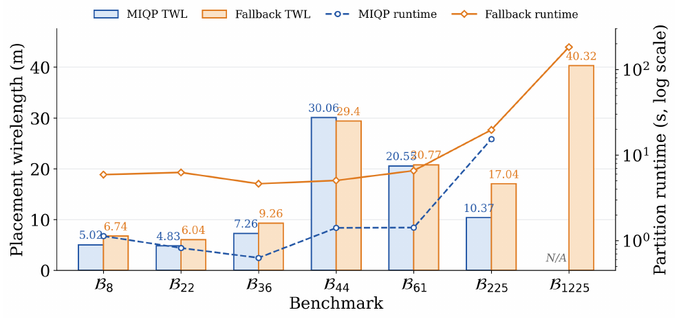
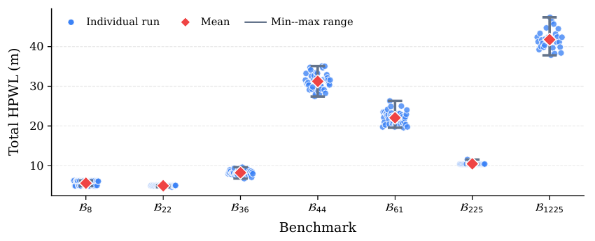
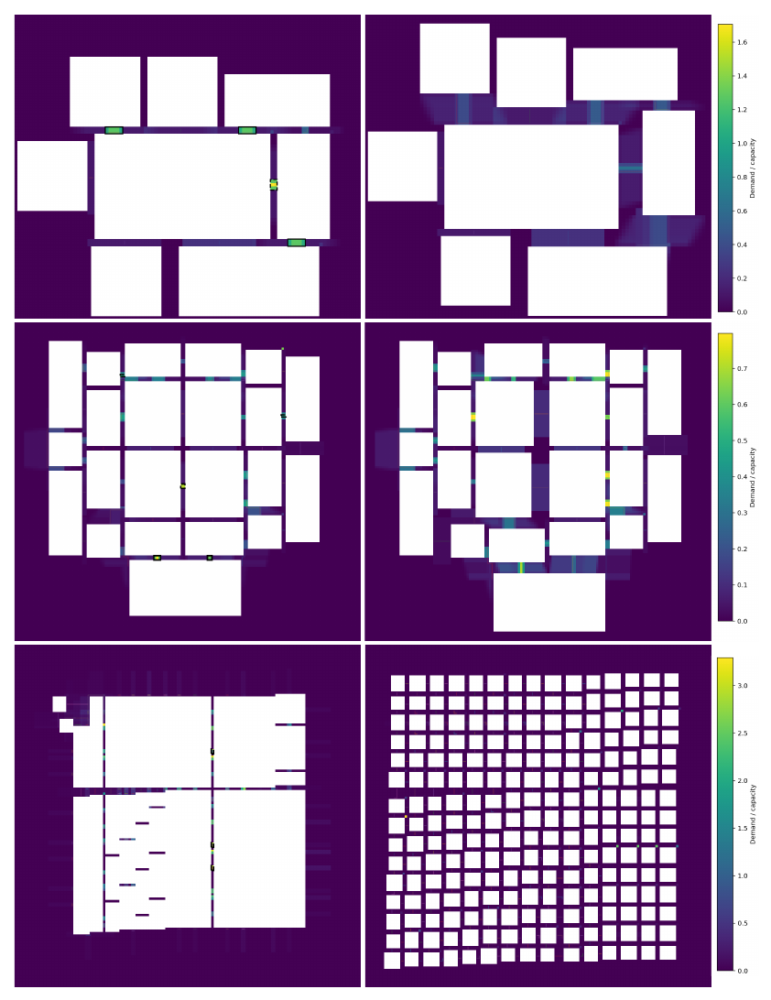
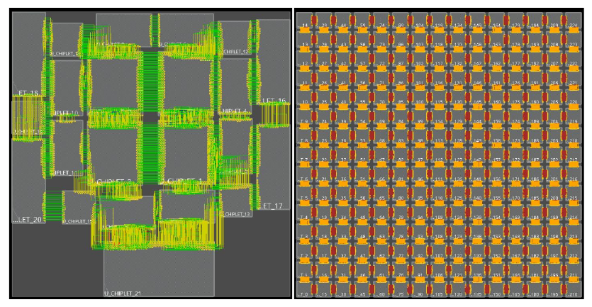
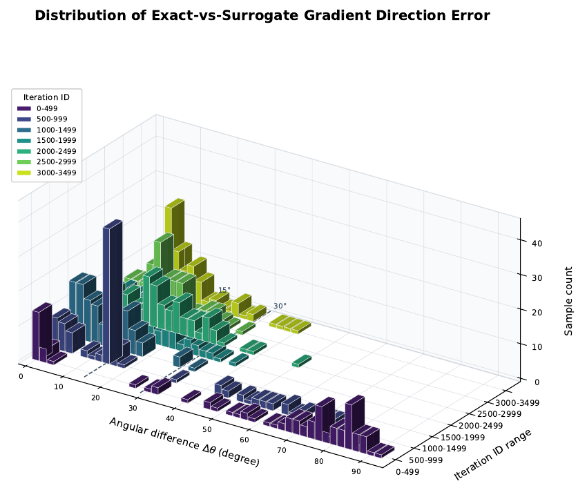

# ULTRA-2.5D Experimental Results

This page compiles experimental figures, tables, and data from the paper and both rounds of response letters, covering designs with up to **1225 chiplets**. Figure and table numbers, units, and experimental conditions follow their respective sources.

## Placement Evolution

  

*Placement evolution of B₂₂ (top) and B₂₂₅ (bottom). Different background colors indicate different reticle regions. Reproduced from Fig. 10 of the paper.*

## Performance Comparison

The experimental platform consists of dual Intel Xeon Gold 5320 CPUs (104 threads) and an NVIDIA A800 80GB GPU, with LP/MIQP subproblems solved by CPLEX. Below, **Table IV** of the paper is split into wirelength, runtime, and cross-reticle metrics, with the repetitive normalized Rate columns omitted.

**Total half-perimeter wirelength of the final placement (TWL, m; lower is better)**

| Benchmark | ULTRA-2.5D | GD-NF (flipping disabled) | ATPlace2.5D [17] | SA [11] | MILP [15] |
| --- | ---: | ---: | ---: | ---: | ---: |
| B₈ | **5.02** | 11.10 | 7.49 | 28.07 | 6.85 |
| B₂₂ | **4.83** | 11.82 | 5.31 | 44.92 | 9.60 |
| B₃₆* | 7.26 | 7.83 | 8.77 | 23.04 | **7.05** |
| B₄₄* | **30.06** | 34.45 | 50.51 | 126.64 | 32.18 |
| B₆₁* | **20.55** | 23.04 | 32.99 | 94.22 | 22.50 |
| B₂₂₅ | **10.37** | 36.10 | — | — | — |
| B₁₂₂₅ | **40.32** | 179.20 | — | — | — |
| Geometric mean, first five cases | **10.17** | 15.22 | 14.22 | 51.05 | 12.74 |
| Geometric mean, all seven cases | **12.42** | 24.48 | — | — | — |

**Runtime (s)**

| Benchmark | ULTRA-2.5D (GPU) | ULTRA-2.5D (CPU) | ATPlace2.5D (planning + gradient descent) | SA [11] | MILP [15] |
| --- | ---: | ---: | ---: | ---: | ---: |
| B₈ | 5.57 | 2.57 | 2.98 + 8 | 16.33 | 3.05 |
| B₂₂ | 5.91 | 6.37 | 33.00 + 11 | 33.25 | 1611.01† |
| B₃₆* | 3.34 | 11.24 | 632.23 + 17 | 17.82 | 1602.89† |
| B₄₄* | 4.28 | 8.22 | 635.45 + 22 | 57.26 | 1604.75† |
| B₆₁* | 5.76 | 13.50 | 665.76 + 39 | 93.36 | 1604.23† |
| B₂₂₅ | 18.73 | 39.54 | — + 50 | — | — |
| B₁₂₂₅ | 260.47 | 646.34 | — | — | — |
| Geometric mean, first five cases | 4.86 | 7.28 | 121.34 + 16.66 | 34.89 | 458.56 |
| Geometric mean, all seven cases | 10.41 | 17.59 | — | — | — |

Source: Table IV of the paper. `*` denotes benchmarks from ATPlace2.5D; reference numbers follow the paper. `†` indicates that a solution was available when the 1600 s solver time limit was reached; `—` indicates a timeout without the corresponding result. The first-five-case geometric mean includes only the five cases completed by all methods; the all-seven-case geometric mean is reported only for methods that complete every case.

Our method reports the runtime of the complete placement flow; ATPlace2.5D separately reports the combined runtime of its two planning stages and its analytical gradient descent runtime. On B₂₂₅, ATPlace2.5D takes 50 s for analytical placement, but the subsequent legalization times out, so no final legal placement is obtained. The original table's `121.34 + 16.66` gives the geometric mean of each component separately.

Across the five commonly completed cases, the geometric-mean TWL ratio of ATPlace2.5D to our method is **1.40×**. Even when only its gradient descent stage is counted, its geometric-mean runtime ratio remains **3.43×** that of our complete flow.

Cross-reticle metrics: expand to view all data from Table IV of the paper

To avoid an excessively wide table, each cell lists four counts in the order **Cross-CP / CR-Nets / CR-Critical / CR-Chiplets**: connection crossover pairs, cross-reticle nets, cross-reticle critical nets, and cross-reticle chiplets, respectively.

| Benchmark | ULTRA-2.5D | GD-NF | SA [11] | MILP [15] |
| --- | --- | --- | --- | --- |
| B₈ | 0 / 0 / 0 / 1 | 0 / 0 / 0 / 1 | 10 / 512 / 512 / 3 | 0 / 128 / 128 / 3 |
| B₂₂ | 0 / 288 / 0 / 2 | 3 / 688 / 0 / 2 | 95 / 816 / 560 / 4 | 2 / 576 / 160 / 6 |
| B₃₆* | 12 / 88 / 0 / 0 | 15 / 176 / 88 / 0 | 77 / 484 / 396 / 0 | 13 / 176 / 88 / 0 |
| B₄₄* | 5 / 528 / 0 / 0 | 6 / 528 / 0 / 0 | 62 / 1672 / 1180 / 11 | 3 / 1144 / 880 / 5 |
| B₆₁* | 11 / 1056 / 0 / 1 | 13 / 1056 / 0 / 1 | — | 43 / 1320 / 616 / 7 |
| B₂₂₅ | 0 / 1920 / 0 / 0 | 137 / 1920 / 0 / 0 | — | — |
| B₁₂₂₅ | 0 / 4480 / 0 / 0 | 838 / 4480 / 0 / 0 | — | — |

Source: Table IV of the paper. These metrics describe connectivity and placement characteristics, rather than final violation counts. ATPlace2.5D does not consider multi-reticle constraints, so the original table does not report its corresponding metrics.

## Ablation Studies

**Flipping and GPU acceleration.** The two performance tables above also provide these ablations: GD-NF retains the rest of the flow and disables only flipping, yielding TWL values **1.08–4.45×** those of the full method; the CPU version retains the same algorithm and configuration, changing only the execution device. GPU acceleration provides a **2.48×** speedup on B₁₂₂₅, while CPU execution is faster on the smallest case, B₈. Source: Table IV of the paper.

**Ordinary Softmax versus Gumbel-softmax.** The ordinary Softmax configuration sets `use_gumbel=false` while retaining the orientation formulation and the rest of the placement flow.

| Benchmark | Ordinary Softmax TWL (m) | Ordinary Softmax violations | Gumbel-softmax TWL (m) | Gumbel-softmax violations |
| --- | ---: | ---: | ---: | ---: |
| B₈ | 2.83 | 10 | 5.02 | 0 |
| B₂₂ | 5.01 | 2 | 4.83 | 0 |
| B₃₆* | 6.27 | 21 | 7.26 | 0 |
| B₄₄* | 31.36 | 16 | 30.06 | 0 |
| B₆₁* | 23.55 | 38 | 20.55 | 0 |
| B₂₂₅ | 25.87 | 0 | 10.37 | 0 |
| B₁₂₂₅ | 79.90 | 0 | 40.32 | 0 |

Source: RV1 Table R4. Ordinary Softmax does not produce fully legal placements on the first five cases. Its TWL is reported for completeness and cannot be directly interpreted as better wirelength than that of legal results.

**CRA cross-reticle coverage constraints.** RV2 uses a synthetic stress case containing two adjacent reticles, one cross-reticle chiplet, and two ordinary chiplets; the coverage requirements total 95% of the cross-reticle chiplet's area. Each condition comprises 10 independent random runs, changing only the CRA weight configuration and evaluating coverage deficits **at the end of global placement, before legalization**.

| CRA | Minimum deficit (%) | Maximum deficit (%) | Mean deficit (%) | Population SD (percentage points) | Runs satisfying coverage requirements |
| --- | ---: | ---: | ---: | ---: | ---: |
| On | 0.000000 | 0.123643 | 0.012364 | 0.037093 | 9/10 |
| Off | 0.000000 | 67.117966 | 23.822335 | 28.810908 | 5/10 |

Source: RV2 Table R7.

## Partitioning Strategies

  

*Source: RV1 Fig. R3, corresponding to Fig. 11 of the paper. Bars show the final TWL after subsequent placement and legalization; lines show partition runtime, with a logarithmic scale on the right axis.*

MIQP takes **0.63–15.36 s** on the first six cases, with solver-reported optimality gaps of 0. For B₁₂₂₅, no feasible partition is obtained within the **90 s** time limit, so the heuristic fallback is used. MIQP achieves lower final TWL on most cases it can complete, while the heuristic strategy completes all seven cases. Source: Section IV-C of the paper.

## Robustness Across Random Seeds

  

*Source: RV1 Fig. R6, corresponding to Fig. 12 of the paper. Blue points denote independent random runs, and red diamonds denote the means; inner error bars show the mean ± one standard deviation, while outer error bars span the minimum to maximum.*

| Scope | TWL coefficient of variation (standard deviation / mean) | Worst-case TWL increase relative to the mean |
| --- | --- | --- |
| Seven benchmarks | 1.53%–10.64%, with six below 8% | 1.79%–19.36% |
| B₂₂₅ | 2.20% | 10.36% |
| B₁₂₂₅ | 5.63% | 13.44% |

Source: Section IV-D of the paper. The worst-case TWL for each benchmark remains within 20% of its corresponding mean, and variation does not increase monotonically with design scale. These statistics describe the result distributions across multiple random seeds.

## Routability and Legality Validation

**Comparison before and after routability refinement.** RV2 compares placements with and without routability refinement in Innovus on B₂₂, using the same netlist and routing rules. The test includes 22 chiplets, 2160 signal nets, a 24,000 × 24,000 μm² layout, four metal layers M1–M4, and a nominal GCell pitch of 600 μm, using Innovus v21.39-s058_1.

| Metric | Without refinement | With refinement | Relative reduction (%) |
| --- | ---: | ---: | ---: |
| Maximum congestion (%) | 212.500 | 145.000 | 31.76 |
| Reported-area average congestion (%) | 96.144 | 94.556 | 1.65 |
| Total overcongested GCell-layer fraction (%) | 3.34 | 1.94 | 41.92 |
| Worst-layer overcongested GCell fraction (%) | 7.68 | 3.90 | 49.22 |
| Horizontal overflow (%) | 2.22 | 1.08 | 51.35 |
| Vertical overflow (%) | 1.12 | 0.85 | 24.11 |
| Track-assignment overlap (%) | 1.16 | 0.43 | 62.93 |
| Whole-die track-length utilization (%) | 11.452 | 11.384 | 0.59 |

Source: RV2 Table R5. Congestion is routing demand divided by capacity; a value above 100% indicates that demand exceeds capacity. Average congestion is capacity-weighted. Relative reductions follow the original table and may differ slightly from values recalculated using the displayed precision. Refinement mainly alleviates local hotspots; congestion and overflow remain in this test.

Per-layer routing demand: expand to view RV2 Table R6

| Metal layer | Preferred direction | Wirelength without refinement (m) | Wirelength with refinement (m) | Utilization without refinement (%) | Utilization with refinement (%) |
| --- | --- | ---: | ---: | ---: | ---: |
| M1 | Horizontal | 1.9983 | 1.5980 | 13.877 | 11.153 |
| M2 | Vertical | 1.6668 | 1.5638 | 11.575 | 10.878 |
| M3 | Horizontal | 1.4502 | 1.5750 | 10.071 | 10.992 |
| M4 | Vertical | 1.3270 | 1.6453 | 10.164 | 12.625 |

Source: RV2 Table R6. Utilization is estimated as global-route wirelength divided by available track length. Demand decreases on M1 and M2 and increases on M3 and M4, reflecting redistribution of routing demand across layers.

Routability heatmaps: expand to view hotspot changes before and after refinement

  

*Source: RV1 Fig. R4. Each row represents a benchmark, with the initial state on the left and the final state on the right. The same coordinate range and color scale are used within each row, and boxes mark detected hotspots.*

**Independent legality checking.** The independent checker in RV1 reports zero violations for all seven main benchmarks. Checks cover chiplet overlaps, placement boundaries, reticle coverage and assignments, stitching regions, restrictions on assigning both connected chiplets to stitching regions, and critical-net constraints. Source: RV1 Table R3.

  

*Innovus routing results for B₂₂ (left) and B₂₂₅ (right). Source: RV1 Fig. R5. RV1 reports zero final global-routing overflow for all seven cases under its abstract routing configuration. The quantitative comparison in RV2 above is a separate routing experiment and should be interpreted using its own configuration and reporting definitions. Geometric legality checking is also not equivalent to full process DRC signoff.*

## Additional Validation of the Continuous Models

Orientation discretization: expand to view angular deviations and TWL changes

In snapshots taken before legalization, rotation angles are mapped to the nearest `0° / 90° / 180° / 270°`, and flip angles to the nearest `0° / 180°`. The following table retains all statistics from RV2 Table R2. Angles are in degrees, and SD denotes population standard deviation.

| Benchmark | Rotation deviation Min / Max / Mean / SD (°) | Flip deviation Min / Max / Mean / SD (°) |
| --- | --- | --- |
| B₈ | 0 / 4.791e-5 / 5.989e-6 / 1.585e-5 | 0 / 9.582e-5 / 1.198e-5 / 3.169e-5 |
| B₂₂ | 0 / 4.384e-5 / 2.285e-6 / 9.162e-6 | 0 / 8.768e-5 / 3.985e-6 / 1.826e-5 |
| B₃₆* | 0 / 8.569e-5 / 2.476e-6 / 1.407e-5 | 0 / 0 / 0 / 0 |
| B₄₄* | 0 / 6.337e-5 / 1.586e-6 / 9.470e-6 | 0 / 0 / 0 / 0 |
| B₆₁* | 0 / 1.155e-4 / 1.894e-6 / 1.467e-5 | 0 / 0 / 0 / 0 |
| B₂₂₅ | 0 / 4.951e-5 / 2.462e-7 / 3.307e-6 | 0 / 9.902e-5 / 4.810e-7 / 6.612e-6 |
| B₁₂₂₅ | 0 / 9.485e-5 / 7.752e-8 / 2.709e-6 | 0 / 0 / 0 / 0 |

With all chiplet coordinates fixed, only the orientations are discretized, and pin positions and TWL are then recomputed:

| Benchmark | TWL before discretization (m) | TWL after discretization (m) | Relative change (%) |
| --- | ---: | ---: | ---: |
| B₈ | 5.98 | 5.98 | 6.305e-6 |
| B₂₂ | 4.83 | 4.83 | 1.707e-6 |
| B₃₆* | 7.56 | 7.56 | 8.207e-6 |
| B₄₄* | 30.92 | 30.92 | 1.695e-6 |
| B₆₁* | 23.05 | 23.05 | 4.067e-15 |
| B₂₂₅ | 10.45 | 10.45 | 4.867e-7 |
| B₁₂₂₅ | 40.26 | 40.26 | -5.431e-9 |

Source: RV2 Table R2 and Table R3. TWL values retain the display precision of the original table, while relative changes are computed from unrounded values. These data come from snapshots in the discretization experiment and should not be mixed with final legalized TWL values in the main performance table. The maximum absolute relative change is approximately **8.21e-6%**.

**Rotated-rectangle overlap approximation.** The exact polygon-intersection area of rotated rectangles is used as the geometric reference to evaluate whether the overlap surrogate model corresponding to Eq. (9) of the paper provides reasonable optimization directions.

  

*Source: RV2 Fig. R1, from the same experiment as Fig. R2. The figure shows the distributions of angular gradient-direction errors across iteration intervals. Bar heights indicate sample counts, and 15° and 30° are reference angles.*

For each of seven iteration intervals on B₂₂, 100 chiplet pairs with positive exact overlap and stable, nonzero reference gradients are sampled, yielding 700 samples in total. The central finite-difference gradient of the exact rotated-rectangle intersection area serves as the reference for evaluating the surrogate gradient's directional error Δα. Samples are not excluded based on directional error.

| Iteration range | Samples | Mean Δα (°) | Median Δα (°) | Mean cosine similarity | Fraction with Δα ≤ 30° (%) |
| --- | ---: | ---: | ---: | ---: | ---: |
| 0–499 | 100 | 60.3390 | 75.2268 | 0.4017 | 20 |
| 500–999 | 100 | 24.0838 | 15.0817 | 0.8480 | 73 |
| 1000–1499 | 100 | 8.9653 | 7.0920 | 0.9803 | 99 |
| 1500–1999 | 100 | 15.7001 | 14.0691 | 0.9537 | 94 |
| 2000–2499 | 100 | 15.4631 | 13.7253 | 0.9517 | 96 |
| 2500–2999 | 100 | 10.8384 | 9.7776 | 0.9760 | 99 |
| 3000–3499 | 100 | 11.7948 | 8.8876 | 0.9695 | 96 |

Source: RV2 Table R1, which reports the same data as Table R4. After 1000 iterations, the mean directional error is approximately 9°–16°. Iterations beyond 3500 are excluded because too few overlapping samples remain. This experiment evaluates gradient direction, rather than providing an error bound for approximate areas or gradient magnitudes.

